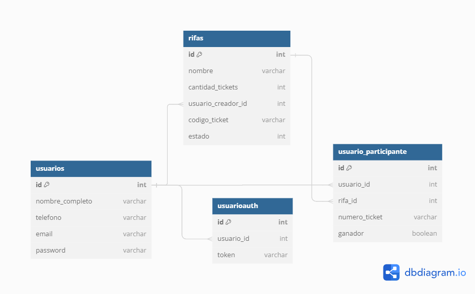
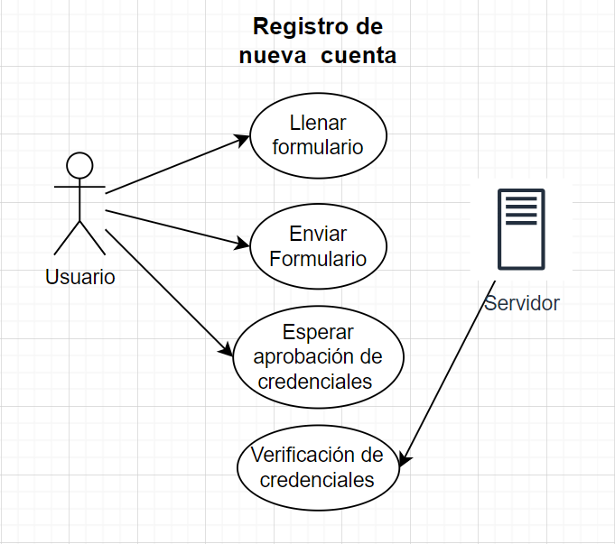
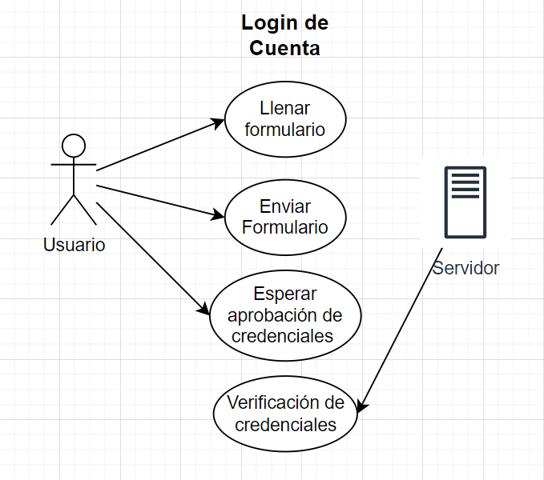
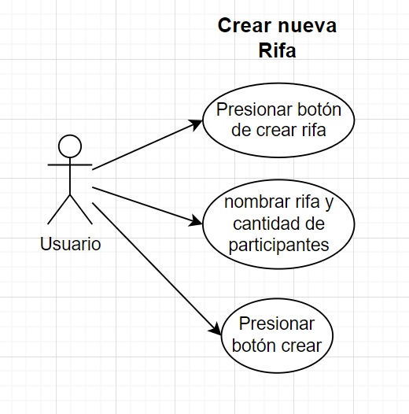
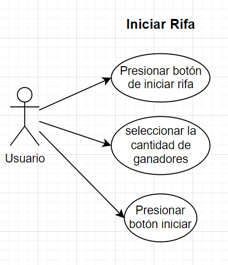
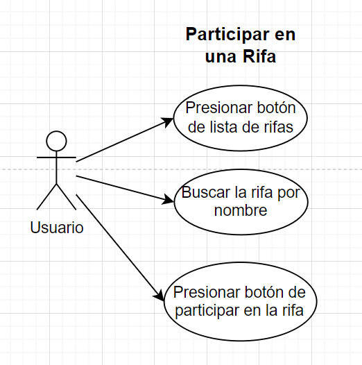

# PracticotresAPI

## Descripción del Proyecto
PracticotresAPI es una API desarrollada en Node.js que proporciona un conjunto de endpoints para manejar gestión de usuarios, las autenticaciones y tokens, las rifas, los usuarios que participan en cada una de las rifas. Este proyecto está construido utilizando el framework Express y Sequelize como ORM para interactuar con una base de datos MySQL.

## Tecnologías Utilizadas
- **Node.js**: Entorno de ejecución para JavaScript en el servidor.
- **Express**: Framework web para construir la API.
- **Sequelize**: ORM para gestionar interacciones con la base de datos MySQL.
- **MySQL**: Sistema de gestión de bases de datos relacional.
- **dotenv**: Manejo de variables de entorno.
- **body-parser**: Middleware para manejar cuerpos de solicitudes.
- **cors**: Middleware para habilitar CORS.
- **express-fileupload**: Middleware para manejar la subida de archivos.
- **nodemon**: Herramienta para reiniciar automáticamente el servidor en desarrollo.
- **ESLint**: Herramienta de análisis estático para asegurar la calidad del código.

## Requerimientos para la Instalación
Antes de instalar y ejecutar este proyecto, asegúrate de tener instalados los siguientes componentes en tu máquina:

- **Node.js**: Versión 14 o superior. [Descargar Node.js](https://nodejs.org/)
- **npm**: Versión 6 o superior (viene con Node.js).

## Instalación
Sigue los pasos a continuación para configurar y ejecutar el proyecto localmente:

1. Clona el repositorio desde GitHub:
    ```bash
    git clone <URL_DEL_REPOSITORIO>
    ```

2. Navega al directorio del proyecto:
    ```bash
    cd practicotresapi
    ```

3. Instala las dependencias del proyecto:
    ```bash
    npm install
    ```

4. Configura las variables de entorno:
    Crea un archivo `.env` en la raíz del proyecto con la siguiente información:

    ```plaintext
    DB_HOST=localhost
    DB_USER=root
    DB_PASSWORD=root
    DB_NAME=practicotres
    ```

## Ejecución
Para iniciar la aplicación, utiliza el siguiente comando:

```bash
npm start
```

La aplicación se ejecutará en el puerto `3000` por defecto. Abre tu navegador y navega a `http://localhost:3000` para acceder a la API.

## Endpoints
La API proporciona los siguientes endpoints para interactuar con los recursos:

### Autenticación

- **POST /api/login**: Iniciar sesión con un usuario registrado.
- **POST /api/register**: Registrar un nuevo usuario.
- **GET /api/me**: Obtener los detalles del usuario autenticado.

### Usuarios

- **GET /api/usuarios**: Obtener todos los usuarios.
- **GET /api/usuarios/noprifas/:id**: Obtener los usuarios que no han participado en la rifa con el ID especificado.
- **GET /api/usuarios/noprifas/search/:id**: Obtener los usuarios que no han participado en la rifa con el ID especificado (búsqueda por nombre con query=nombre).
- **GET /api/usuarios/partganadores/:id**: Generar los participantes ganadores de la rifa con el ID especificado.
- **GET /api/usuarios/ganadores/:id**: Obtener la lista de ganador/es de la rifa con el ID especificado.

### Rifas

- **GET /api/rifas**: Obtener todas las rifas.
- **GET /api/rifas/search**: Buscar rifas por nombre, que esten en estado activo y que no tengan de creador al que esta buscando (búsqueda por nombre con query=nombre).
- **GET /api/rifas/me**: Obtener las rifas creadas por el usuario autenticado.
- **GET /api/rifas/:id**: Obtener una rifa por su ID.
- **POST /api/rifas**: Crear una nueva rifa.
- **PUT /api/rifas/:id**: Actualizar una rifa por su ID.
- **DELETE /api/rifas/:id**: Eliminar una rifa por su ID.

### Participaciones

- **GET /api/usuariosp**: Obtener todos los usuarios participantes.
- **GET /api/usuariosp/:id**: Obtener el usuario participante por su ID.
- **POST /api/usuariosp**: Añadir un usuario participante.

## Enlace de descarga Postman
Para probar los endpoints de la API, puedes descargar el archivo de colección de Postman desde el siguiente enlace:

[Descargar Colección de Postman](https://drive.google.com/file/d/170cPJ9LnwmKH6GSs9RyWohSbjj-LlLGm/view?usp=sharing)

## Diagrama de Base de Datos
El siguiente diagrama muestra la estructura de la base de datos utilizada en el proyecto:



## Casos de Uso
Los casos de uso de la API son los siguientes:

1. **Registrar un nuevo usuario**: Un usuario puede registrarse en la aplicación proporcionando su nombre, correo electrónico y contraseña.



2. **Iniciar sesión**: Un usuario registrado puede iniciar sesión en la aplicación proporcionando su correo electrónico y contraseña.



3. **Crear una nueva rifa**: Un usuario autenticado puede crear una nueva rifa proporcionando un nombre, descripción, fecha de inicio, fecha de fin y el número de ganadores.



4. **Iniciar una rifa**: Un usuario autenticado puede iniciar una rifa que haya creado previamente.



5. **Participar en una rifa**: Un usuario autenticado puede participar en una rifa proporcionando el ID de la rifa.



## Finalización
¡Felicidades! Has configurado y ejecutado el proyecto PracticotresAPI localmente. Ahora puedes comenzar a interactuar con la API utilizando los endpoints proporcionados.